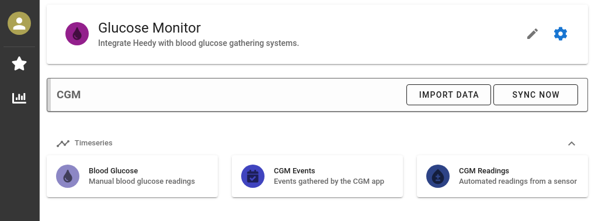

# Heedy CGM Plugin

This plugin provides integration of heedy (>=0.4.1) with the glucose monitoring ecosystem.
After installing the plugin, add the `Glucose Monitor` app to your user using the add app dialog, and then you can import data, or set up services to sync with Heedy (in plugin settings,).



## Integrations

### Nightscout

The CGM app can auto-sync data from [Nightscout](https://github.com/nightscout/cgm-remote-monitor), keeping Heedy up-to-date with glucose values. You can set up the server and API token in app settings (blue gear icon in top right).

### XDrip+

The CGM app can import data from a database export of the [XDrip](https://github.com/NightscoutFoundation/xDrip) Android app (import data button).

## Building

This plugin is based on https://github.com/heedy/heedy-template-plugin, and can be run/debugged using the instructions there.

To build a release, run:

```
make
```

The resulting plugin zip file will be in the `dist/` folder.
